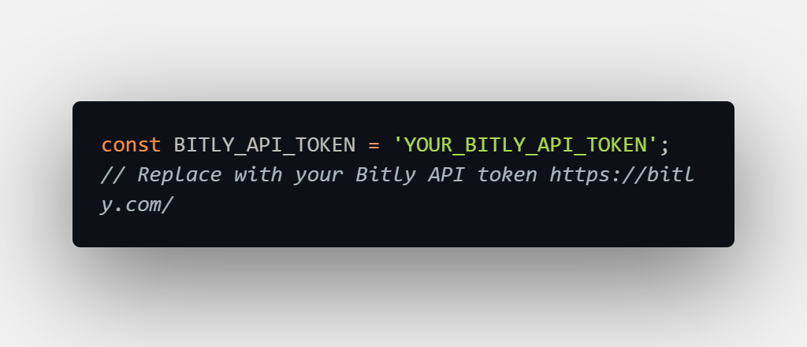

**URL Shortener Chrome Extension**
>Easily shorten URLs with just a right-click. This Chrome extension integrates with Bitly to generate shortened URLs on-the-fly.

**Features:**
>Right-click on any page to instantly generate a shortened URL.
>Access the most recently shortened URL by clicking on the extension icon.

**Installation:**
>Clone or download this repository.
>Navigate to chrome://extensions/ in your Chrome browser.
>Enable "Developer mode" (usually in the top-right corner).
>Click "Load unpacked" and select the directory where you have this repository.
>Once installed, you'll see the extension icon in your toolbar.

**Usage:**
>Right-click on any webpage you want to shorten.
>Click on "Shorten URL" from the context menu.
>The URL is shortened using Bitly.
>Click on the extension's icon in the toolbar to view the most recently shortened URL.

**Configuration:**
>Before using the extension, ensure you've set your Bitly API token in the background.js file:
>
>Get your Bitly API token by signing up on Bitly's Developer Platform and creating a new application. https://bitly.com/

**Files Overview:**
>manifest.json: The metadata of the extension, declaring permissions, background scripts, icons, and other settings.
>background.js: Handles the context menu creation and URL shortening logic.
>popup.html & popup.js: Displays the most recent shortened URL when you click on the extension icon.
>styles.css: Styles for the popup display.
>icon.png: The extension's icon (replace with your own if desired).

**Dependencies:**
>The extension uses the Bitly API for URL shortening.

**Troubleshooting:**
>If the extension isn't working:
>Ensure you've set the correct Bitly API token in background.js.
>Check chrome://extensions/ for any error messages or logs.
>Feel free to raise an issue on this repository, and I'll be happy to help!